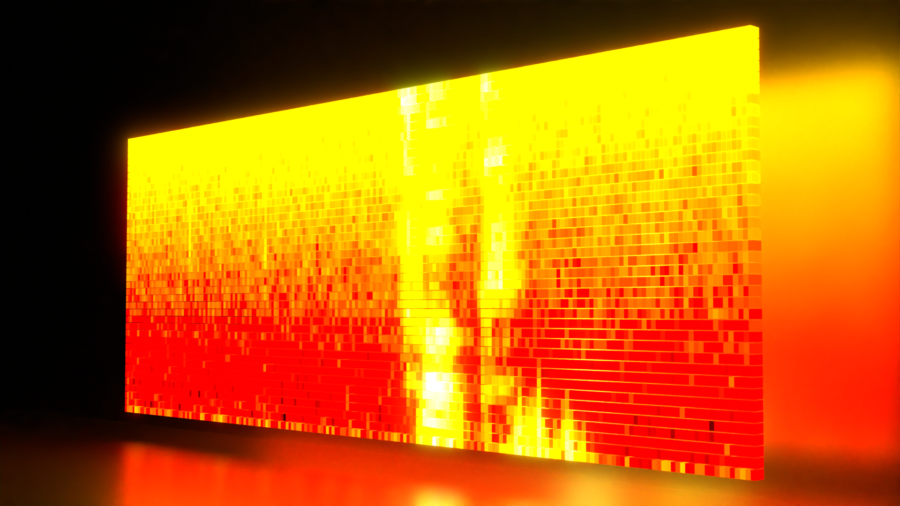
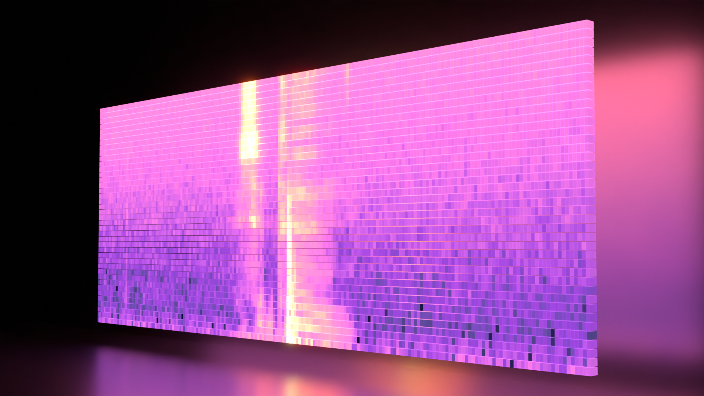
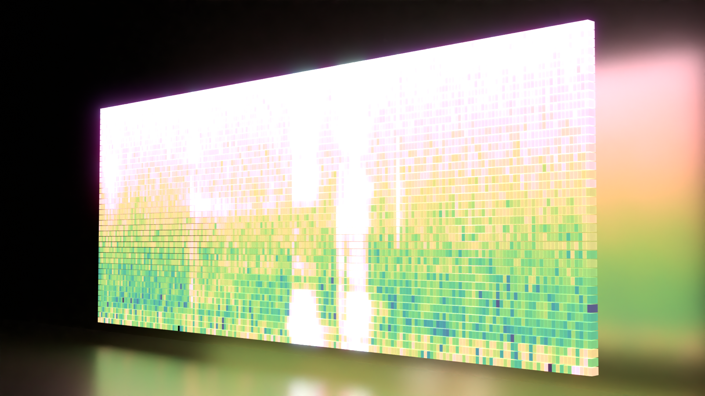
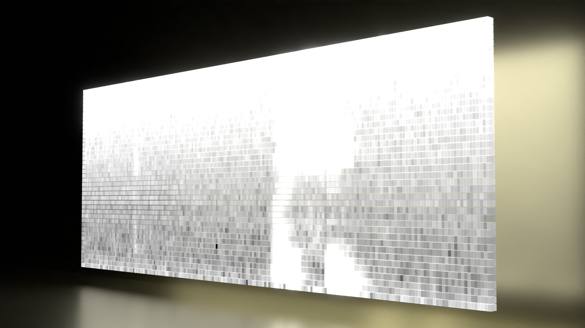
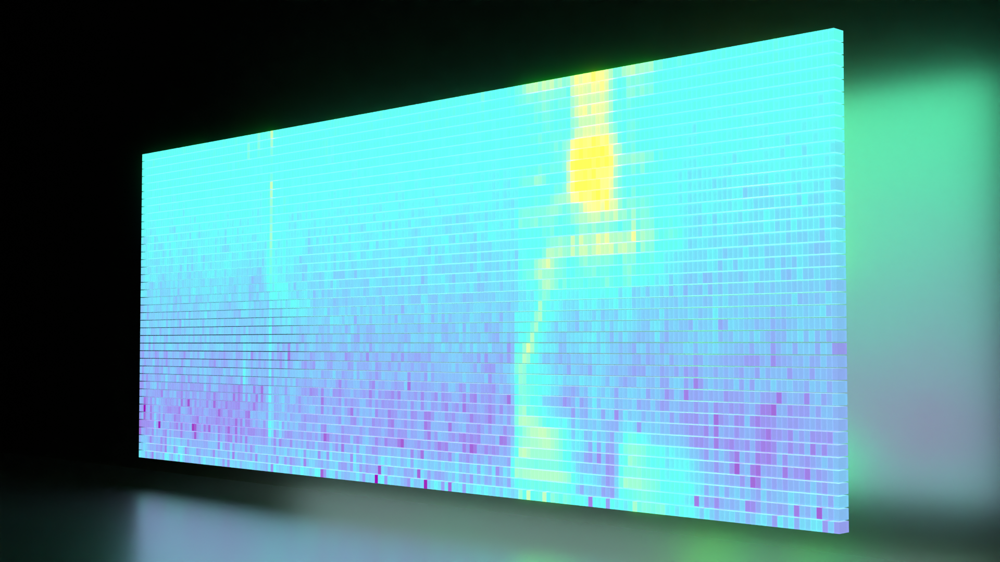

# Art of Acoustic Features

## Panel of 200x40 LEDs displaying Mel-Frequency Spectral Coefficients

I created materials of matplotlib colormaps and applied them to Mel-Frequency Spectral Coefficients.
All the python scripts to generate this art are embedded in [this blender file](AcousticFeatures.blend)

