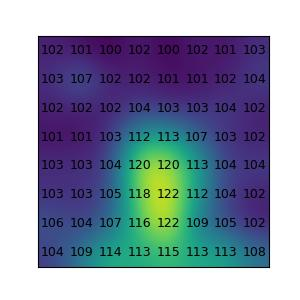

# Full Stack Data Scientist

(Work in progress)

I used to be a full stack data scientist in the past.

This project is to relearn the each technology to become a full stack data scientist again before I visit [EdgeTech+ 2023](https://www.jasa.or.jp/expo/english/).

## [Step 1] Training myself

### [Digital Audio Processing](DigitalAudioProcessing)

The best text book that I have ever read in my life: [C言語ではじめる音のプログラミング―サウンドエフェクトの信号処理](https://www.ohmsha.co.jp/book/9784274206504/)

This folder contains Python-version of the C programmes in the book.

### [Speech Procesing](SpeechProcessing)

In September 2018, I found this great paper on the net: https://haythamfayek.com/2016/04/21/speech-processing-for-machine-learning.html

I relearn it in this project.

### [Rock Paper Scissors](RockPaperScissors)

I developed Rock Paper Scissors on Nucleo L401RE board with Panasonic AMG8833 in January 2019, just after the first relase of STM32Cube.AI (December 2018) became available for developers: [The demo on YouTube](https://www.youtube.com/shorts/d6OYSllaVEs). I remember my excitement on STM32Cube.AI -- AI can run on such a tiny device!

I relearn it in this project by doing this: https://github.com/araobp/stm32-mcu/tree/master/NUCLEO-F401RE/Thermography

STMicroelectronics also developed a toy similar to mine, but with VL53L5: https://stm32ai.st.com/use-case/shifumi-gesture-recognition/

### [Edge AI on STM32](STM32)

This folder is to implement the hardware part of "RockPaperScissors" on STMicroelectronics NUCLEO-L476RG board with the latest version of CubeIDE/CubeMX and STM32Cube.AI.

## [Step 2] Prototyping Acoustic Scene Classification

This is a project to develop edge AI for Acoustic Scene Classification based on STM32Cube.AI, referring to my past project: https://github.com/araobp/acoustic-features which was the best thing I have ever developed in my carrier as an ICT engineer, although it was my hobby project (not a commercial product).

...

## Others

### [Arduino-version of the thermography](Arduino)

Make Jupyter Notebook collect data from this Arduino version of the thermograpy device with Panasonic AMG8833.

This is me.

### [CIFAR 10](CIFAR10)

The best accuracy I have ever achieved is 75%. Can I get a higher score than 75%?

### [MINIST](MNIST)

### [IMDb](IMDb)

### [Titanic](Titanic)

### [Audio](Audio)

## Full Stack Data Scientist -- my definition

- IoT circuit design : Physics, Electronics and CAD
- IoT device prototyping : Circuit board and C/C++ programming
- Feature engineering : Fourier Transform and digital signal processing
- AI and neural network : DNN, CNN, Tensorflow and Keras
- AI application development : Python and Android(Kotlin)
- AI deployment : IoT devices and web apps (Node.js/HTML5/CSS/JavaScript)
- Data Analysis : Jupyter Notebook, numpy, pandas and matplotlib
- AI visualization : Blender

