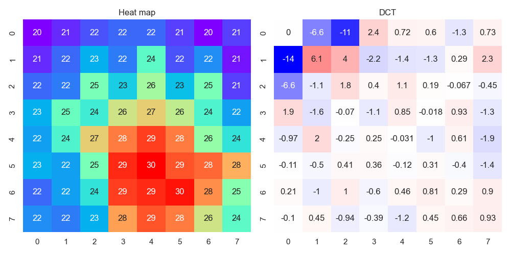
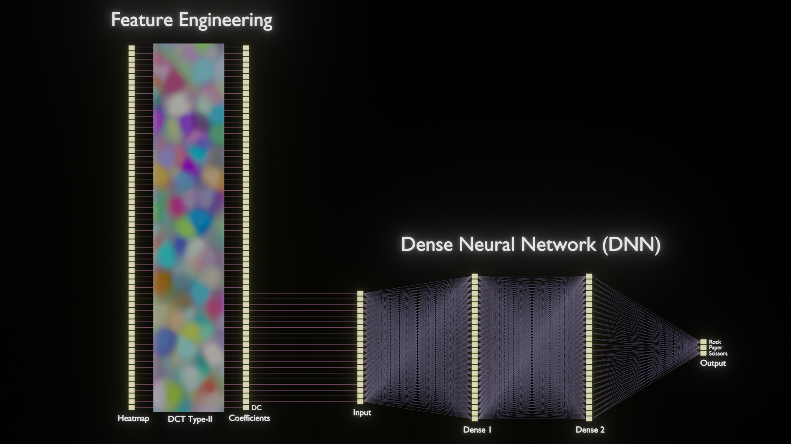

# Edge AI and Digital Signal Processing

Hand gesture "Paper" captured with [AMG8833 infrared array sensor (8x8 resolution)](https://industrial.panasonic.com/products/pt/grid-eye/models/AMG8833), and its DCT Type-II coefficients.

Paco de Lucia's Picado from ["Cepa Andaluza" (Bulerias)](https://youtu.be/NIKWBdthzg4?si=O71p1-v_ynUPurbq) captured with my "Acoustic Feature Camera" device.

In this project, I pick up some of my achievements on edge AI from my past projects, and update them with the latest IDEs such as STM32CubeIDE or Android Studio.

I will also try to create Generative Art with edge AI in this project.

My past projects on edge AI:
- [acoustic-features](https://github.com/araobp/acoustic-features)
- [android-aed](https://github.com/araobp/android-aed)
- [stm32-mcu](https://github.com/araobp/stm32-mcu)

## Project 1: Rock Paper Scissors Machine

- "Rock Paper Scissors" game machine with NUCLEO-L476RG board.
- Digital Twin of the machine made with Blender.

=> **[Rock Paper Scissors](./RockPaperScissors)**

## Project 2: Acoustic Scene Classification (Work in progress)

Note: I have stopped developing this on STM32L4, because X-CUBE-AI has some problems. I will start developing Acoustic Scene Classification on Android instead.

=> **[AcousticSceneClassification](./AcousticSceneClassification)**
---
## Misc

### [Arduino-version of the thermography](misc/Arduino)

Make Jupyter Notebook collect data from this Arduino version of the thermograpy device with Panasonic AMG8833.

This is me.

### Learning by Doing

### DSP-related

- [Digital Audio Processing](misc/DigitalAudioProcessing)
- [Speech Processing for AI](misc/SpeechProcessing)

### Others

- [CIFAR 10](misc/CIFAR10): The best accuracy I have ever achieved is 75%...
- [MINIST](misc/MNIST)
- [IMDb](misc/IMDb)
- [Titanic](misc/Titanic)
- [Audio](misc/Audio)
