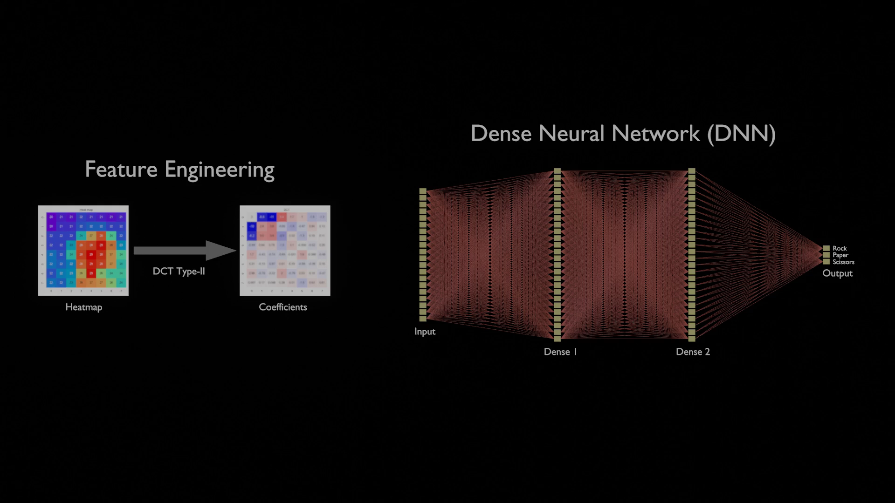

# Edge AI and Digital Signal Processing

[Paco De Lucia "Cepa Andaluza" (Bulerias)](https://youtu.be/NIKWBdthzg4?si=O71p1-v_ynUPurbq)

Edge AI with low-power-consumption MCU is one of key technologies to stop Global Warming.

In this project, I review and improve my achievements on edge AI in my past projects:
- [acoustic-features](https://github.com/araobp/acoustic-features)
- [stm32-mcu](https://github.com/araobp/stm32-mcu)

## AI Rock Paper Scissors

- AI Rock Paper Scissors machine with NUCLEO L476RG board.
- Digital Twin of the machine made with Blender.

=> [Rock Paper Scissors](RockPaperScissors.md)

## Acoustic Scene Classification (Work in progress)

- Acoustic scene classifcation with NUCLEO L476RG board.

=> [Acoustic Scene Classification](AcousticSceneClassification.md)

---

## References

### Delta-Sigma ADCs

- [How delta-sigma ADCs work, Part 1](https://www.ti.com/lit/an/slyt423a/slyt423a.pdf?ts=1694396702991)
- [How delta-sigma ADCs work, Part 2](https://www.ti.com/lit/an/slyt438/slyt438.pdf?ts=1694411423855)
- [Interfacing PDM digital microphones using
 STM32 MCUs and MPUs](https://www.st.com/resource/en/application_note/an5027-interfacing-pdm-digital-microphones-using-stm32-mcus-and-mpus-stmicroelectronics.pdf)
- [Getting started with sigma-delta digital interface
on applicable STM32 microcontrollers](https://www.st.com/resource/en/application_note/an4990-getting-started-with-sigmadelta-digital-interface-on-applicable-stm32-microcontrollers-stmicroelectronics.pdf)
- [Description of STM32L4/L4+ HAL and low-layer drivers](https://www.st.com/resource/en/user_manual/um1884-description-of-stm32l4l4-hal-and-lowlayer-drivers-stmicroelectronics.pdf)
- [Getting started with analog](https://wiki.st.com/stm32mcu/wiki/STM32StepByStep:Getting_started_with_analog)
- [STM32 Microphone Audio Acquisition: Part 8, STM32 - DFSDM interface for MEMS microphones](https://youtu.be/uMCTkd0PGRs)

### CMSIS-DSP

- CMSIP-DSP: https://www.keil.com/pack/doc/CMSIS/DSP/html/index.html
- Python-version of CMSIS-DSP: https://pypi.org/project/cmsisdsp/

---
## Misc

### [Arduino-version of the thermography](misc/Arduino)

Make Jupyter Notebook collect data from this Arduino version of the thermograpy device with Panasonic AMG8833.

This is me.

### Learning by Doing

### DSP-related

- [Digital Audio Processing](DigitalAudioProcessing)
- [Speech Processing for AI](SpeechProcessing)

### Others

- [CIFAR 10](misc/CIFAR10): The best accuracy I have ever achieved is 75%...
- [MINIST](misc/MNIST)
- [IMDb](misc/IMDb)
- [Titanic](misc/Titanic)
- [Audio](misc/Audio)
