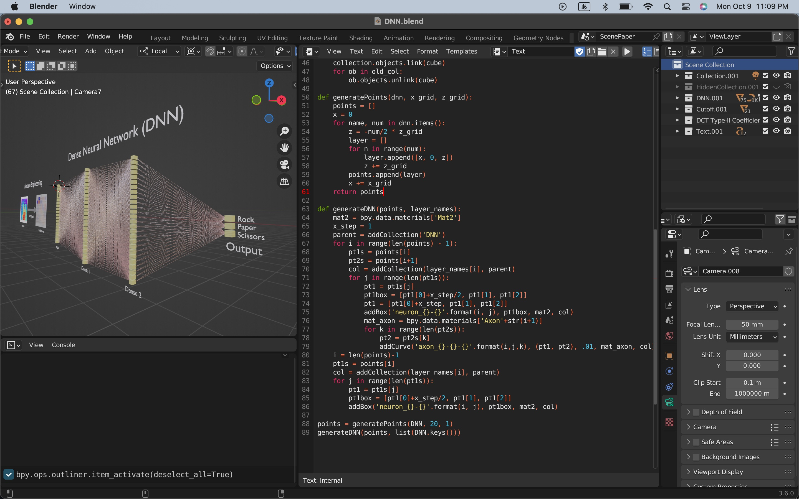

# AI Rock Paper Scissors


I developed Rock Paper Scissors on Nucleo L401RE board with Panasonic AMG8833 in January 2019, just after the first relase of STM32Cube.AI (December 2018) became available for developers: [the demo in on YouTube](https://www.youtube.com/shorts/d6OYSllaVEs). I remember my excitement on STM32Cube.AI -- AI can run on such a tiny device!

I relearn it in this project by doing this: https://github.com/araobp/stm32-mcu/tree/master/NUCLEO-F401RE/Thermography

STMicroelectronics also developed a toy similar to mine, but with VL53L5: https://stm32ai.st.com/use-case/shifumi-gesture-recognition/

```
Step 1: Data collection of 8x8 matrix temperature data.

[AMG8833]--I2C-->[NUCLEO-L476RG] ----UART----> [Thermography GUI] --> CSV files of 8x8 matrix data saved in "/data" folder

Step 2: Training DNN and generate a Keras model in HDF format.

Step 3: Generate code with the HDF file.

Keras model (.h5) --> CubeIDE with STM32Cube.AI --> Generated code

Step 4: Add code to the generated one to make it a "Rock Paper Scissors" game machine.

Step 5: Run the code on the device to play "Rock Paper Scissors".

```

### Step 1: Data collection of 8x8 matrix temperature data

=> [Thermography](STM32/Thermography.md)

### Step 2: Training DNN and generate Keras model

=> [Training DNN with DCT Type-II coefficients as heatmap feature](RockPaperScissors)

The DNN model's recognition performance is much better than [that](https://github.com/araobp/stm32-mcu/blob/master/NUCLEO-F401RE/Thermography/tensorflow/rock_paper_scissors_dct.ipynb) of my old project in 2019: overfitting occured in the old model. The performance has been improved by dropping DCT coefficients of higher frequencies drastically and adding another dense layer.

### Step 3 ~ Step 5: Edge AI implementation and experiment 

=> [RockPaperScissors with CubeIDE and STM32Cube.AI](STM32/RockPaperScissors.md)

The hardware part of "RockPaperScissors" on STMicroelectronics NUCLEO-L476RG board with the latest version of CubeIDE/CubeMX and STM32Cube.AI.

### Extra: 3DCG animation

I have been using Blender since the COVID19 pandemic for prototyping something in a virtual world. This time I use Blender and GIMP to make a digital twin of the edge AI device.

Animations of the digital twin on YouTube:
- [Part 1](https://youtu.be/e6F0C5PsM-8)
- [Part 2](https://youtu.be/bS-bzMsygZQ)

=> [Blender files](blender)

I used Python to animate text on the LCD in the 3DCG scene. The script must be run just once after the blender file is opened.


I also used Python to generate DNN programatically.




