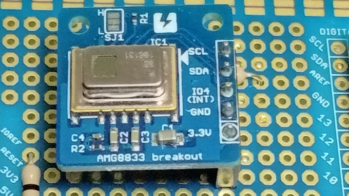
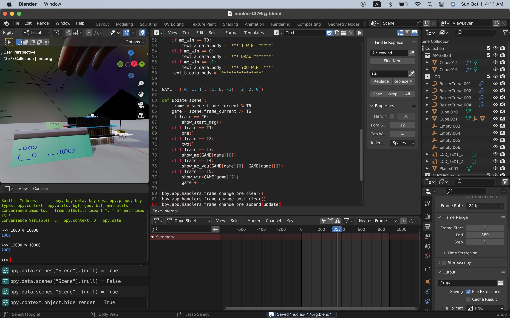

# AI Rock Paper Scissors

I developed Rock Paper Scissors on Nucleo L401RE board with Panasonic AMG8833 in January 2019, just after the first relase of STM32Cube.AI (December 2018) became available for developers: [the demo in on YouTube](https://www.youtube.com/shorts/d6OYSllaVEs). I remember my excitement on STM32Cube.AI -- AI can run on such a tiny device!

I relearn it in this project by doing this: https://github.com/araobp/stm32-mcu/tree/master/NUCLEO-F401RE/Thermography

STMicroelectronics also developed a toy similar to mine, but with VL53L5: https://stm32ai.st.com/use-case/shifumi-gesture-recognition/

### Modeling and training a neural network 

=> [Training DNN with DCT Type-II coefficients as heatmap feature](RockPaperScissors)

The DNN model's recognition performance is much better than [that](https://github.com/araobp/stm32-mcu/blob/master/NUCLEO-F401RE/Thermography/tensorflow/rock_paper_scissors_dct.ipynb) of my old project in 2019: overfitting occured in the old model. The performance has been improved by dropping DCT coefficients of higher frequencies drastically and adding dense layers more.

### Edge AI implementation and experiment 

=> [RockPaperScissors with CubeIDE and STM32Cube.AI](STM32/RockPaperScissors.md)

The folder contains the hardware part of "RockPaperScissors" on STMicroelectronics NUCLEO-L476RG board with the latest version of CubeIDE/CubeMX and STM32Cube.AI.

### 3DCG animation (Work in progress)

Use Blender and GIMP to animate the scene of my edge AI device. This is quite a challenge but worth doing.

=> [Video on YouTube](https://youtu.be/e6F0C5PsM-8)

=> [Blender files](blender)

I used Python to animate text on the LCD in the 3DCG scene:

