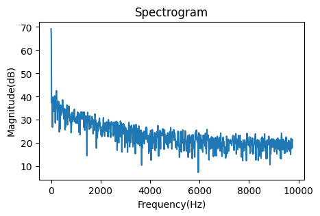

# MEMS mic

What does MEMS mean? [Wikipedia](https://en.wikipedia.org/wiki/MEMS)

I usually use a MEMS mic "SPM0405HD4H" from Knowles, and [its breakout board](https://akizukidenshi.com/catalog/g/gM-05577/) from Akizuki-Denshi, Akihabara.

In this project, I will test its frequency response in the following configuration.:

```
                    . . . . . . . . . . . . . . Arm Cortex-M4 . . . . . . . . . . . .
                    .   +-------+                                FFT                .
     +----- Clock ------|       |          +-----+   +-----+   +------+   +------+  .
     |              .   | DFSDM |-- PCM -->| DMA |-->| RAM |-->| Core |-->|USART2|-- UART/USB --> PC
     |              .   |       |          +-----+   +-----+   | DSP  |   +------+  .
     v              .   |       |                              +------+             .
[MEMS mic]--- PDM ----->|       |                                                   .
                    .   +-------+                                                   .
                    . . . . . . . . . . . . . . . . . . . . . . . . . . . . . . . . .
```

I use [my original Arduino shield](https://github.com/araobp/acoustic-features/tree/master/kicad) with Nucleo L476RG board in this project.


## Filter Regular Channel Conversion

Quote from [Description of STM32L4/L4+ HAL and low-layer drivers](https://www.st.com/resource/en/user_manual/um1884-description-of-stm32l4l4-hal-and-lowlayer-drivers-stmicroelectronics.pdf):

1. Select regular channel and enable/disable continuous mode using HAL_DFSDM_FilterConfigRegChannel().
2. Start regular conversion using HAL_DFSDM_FilterRegularStart(), HAL_DFSDM_FilterRegularStart_IT(),
HAL_DFSDM_FilterRegularStart_DMA() or HAL_DFSDM_FilterRegularMsbStart_DMA().
3. In polling mode, use HAL_DFSDM_FilterPollForRegConversion() to detect the end of regular conversion.
4. In interrupt mode, HAL_DFSDM_FilterRegConvCpltCallback() will be called at the end of regular conversion.
5. Get value of regular conversion and corresponding channel using HAL_DFSDM_FilterGetRegularValue().
6. In DMA mode, HAL_DFSDM_FilterRegConvHalfCpltCallback() and
HAL_DFSDM_FilterRegConvCpltCallback() will be called respectively at the half transfer and at the transfer
complete. Please note that HAL_DFSDM_FilterRegConvHalfCpltCallback() will be called only in DMA
circular mode.
7. Stop regular conversion using HAL_DFSDM_FilterRegularStop(), HAL_DFSDM_FilterRegularStop_IT() or
HAL_DFSDM_FilterRegularStop_DMA().

## Code

I reuse [this code](https://github.com/araobp/NUCLEO-L476RG_DFSDM_PDM-Mic) with some minor modifications.

=> [Code](./MEMSMIC)

## Test result: fs = 19531(Hz)

DFSDM configuration:
- System clock: 80MHz
- Clock divider: 32
- FOSR/decimation: 128
- sinc filter: sinc3
- right bit shift: 6 (2 * 128^3 = 2^22, so 6-bit-right-shift is required to output 16bit PCM)
- Sampling frequency: 80_000_000/32/128 = 19.5kHz

=> [Data visualization on Jupyter Notebook](./data/MEMSMIC_fs_20kHz.ipynb)



## Test result: fs = 39062(Hz)

DFSDM configuration:
- System clock: 80MHz
- Clock divider: 32
- FOSR/decimation: 64
- sinc filter: sinc4
- right bit shift: 6 (2 * 64^4 = 2^25, so 9-bit-right-shift is required to output 16bit PCM)
- Sampling frequency: 80_000_000/32/64 = 39.1kHz

## Reference

- [Getting started with sigma-delta digital interface
on applicable STM32 microcontrollers](https://www.st.com/resource/en/application_note/an4990-getting-started-with-sigmadelta-digital-interface-on-applicable-stm32-microcontrollers-stmicroelectronics.pdf)
- [Description of STM32L4/L4+ HAL and low-layer drivers](https://www.st.com/resource/en/user_manual/um1884-description-of-stm32l4l4-hal-and-lowlayer-drivers-stmicroelectronics.pdf)
- [PCM data resolution on STM32L4](https://github.com/araobp/stm32-mcu/blob/master/tips/RESOLUTION.md)
