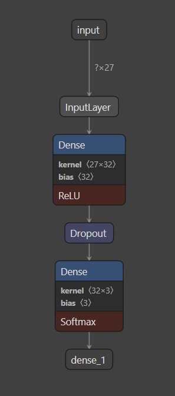
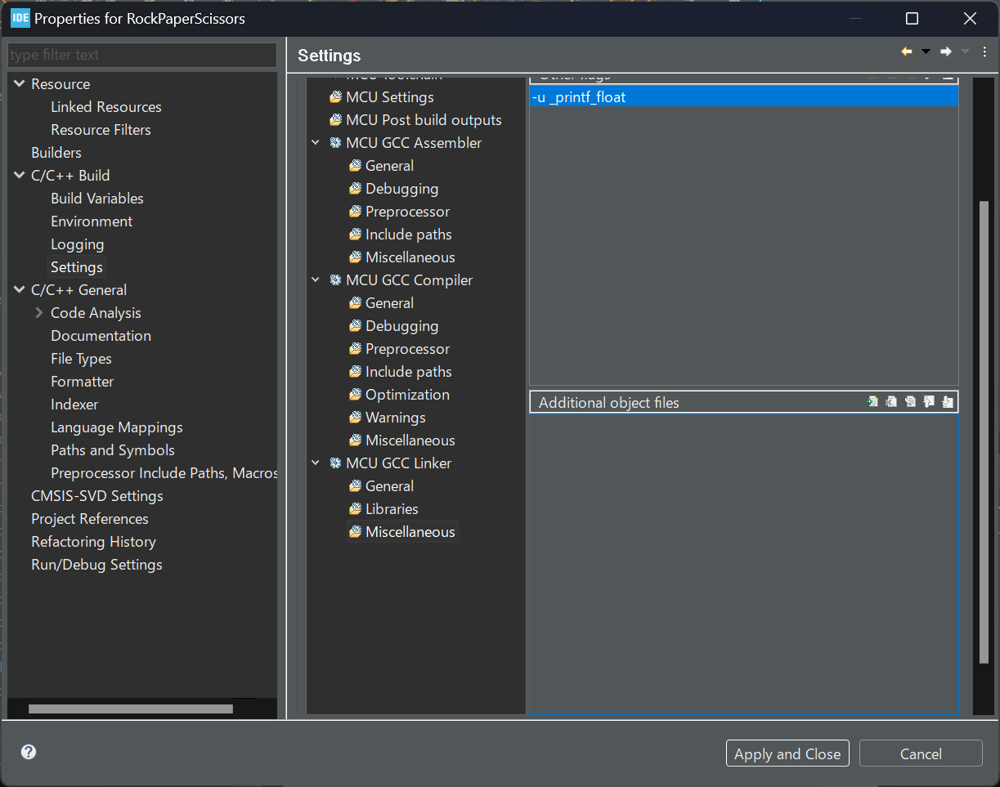

# NUCLEO-L476RG board (STM32L476RGT6 Microcontroller)

## Basic apps

- [HelloWorld](HelloWorld)
- [Clock](Clock)

### I2C pin assignment for Arduino shield

Arduino shield uses PB8 and PB9 for I2C SCL and SDA.


## Rock Paper Scissors with STM32Cube.AI

### Thermography (without AI)


This project is just a thermography app with Panasonic AMG8833 (no AI):
- [Thermography](Thermography)

Its GUI is in this folder: [GUI(Python3)](Thermography/GUI)

```
[NUCLEO L476RG] --- UART (VCP via ST-Link) --- COM port [Thermography GUI]
```

### Rock Paper Scissors (with AI)

This project is AI Rock Paper Scissors with Panasonic AMG8333 (still work in progress):
- [RockPaperScissors](RockPaperScissors)



Startup message to UART Tx:
```
--- AI ROCK PAPER SCISSORS ---
[NETWORK FIND] NN_NAME: network
[NETWORK CREATION] err.type: 0x00, err.code: 0x00
[NETWORK INITIALIZATION] 1
```

### Arudino shield for Panasonic AMG8833

I designed my original Arduino shield for AMG8833 in 2019. Refer to [this page](https://github.com/araobp/stm32-mcu/tree/master/NUCLEO-F401RE/Thermography).

=> [Schematic](https://github.com/araobp/stm32-mcu/blob/master/NUCLEO-F401RE/Thermography/kicad/arduino_board.pdf)

### CubeMX-related problems I faced in this development

***printf issues***

I faced malloc-related build errors after I added "printf" (_write() function) to "main.c". The following setting solved the problem.



The marked part must be elased.

***Build errors***

Building with source code generated by X-Cube-AI results in a lot of errors. Building twice resolves this problem. Why?

***Lack of documentation***

I need example source codes of STM32Cube.AI, but I could not find any on the net.

## References

### CMSIS-DSP library

Refer to the following site: Google search "Configuring DSP libraries on STM32CubeIDE"

[API reference](https://arm-software.github.io/CMSIS_5/General/html/index.html)

#### APIs ("app_x-cube-ai.h")

The following is the basic APIs of STM32Cube.AI:

Find AI network
```
const char* ai_mnetwork_find(const char *name, ai_int idx);
```

Create AI network
```
ai_error ai_mnetwork_create(const char *name, ai_handle* network, const ai_buffer* network_config);
```

Initialize AI network
```
ai_bool ai_mnetwork_init(ai_handle network);
```

Run inference on AI network
```
ai_i32 ai_mnetwork_run(ai_handle network, const ai_buffer* input, ai_buffer* output);
```

## References

- https://stackoverflow.com/questions/59395181/cmsis-dsp-in-stm32cubeide
