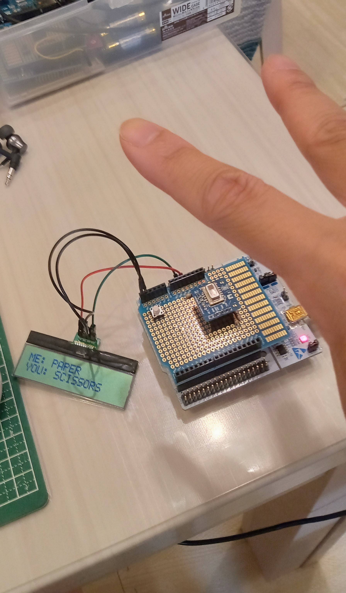
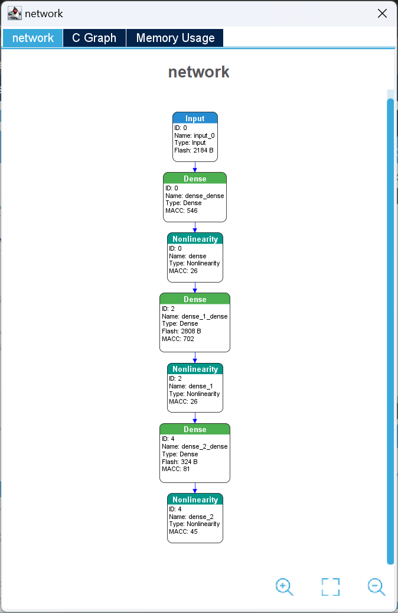
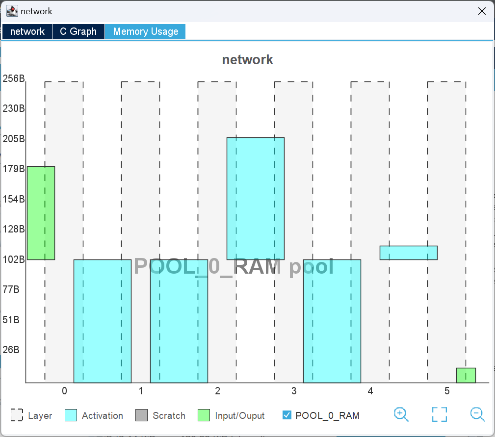
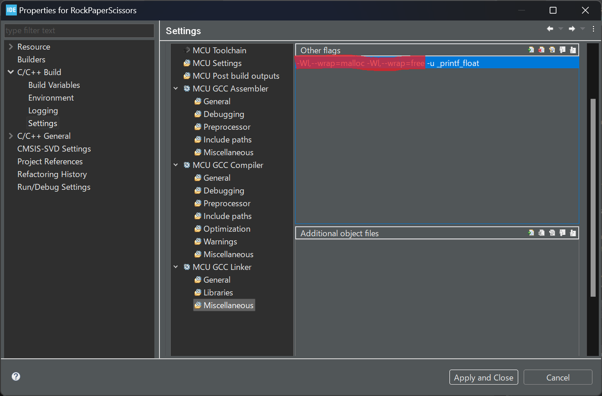
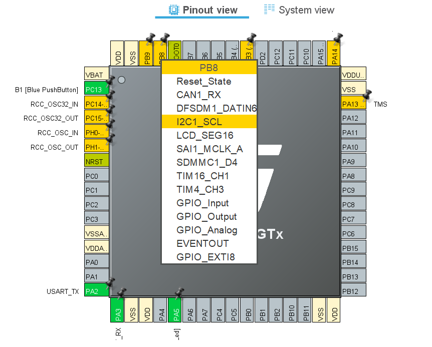

# Rock Paper Scissors with CubeIDE and STM32Cube.AI

Note: the projects in this page are dependent on [my original DCT Type-II implementation](https://github.com/araobp/stm32-mcu/tree/master/NUCLEO-F401RE/DCT) and CMSIS-DSP.

=> [RockPaperScissors](RockPaperScissors)

Its recognition performance is good.

This experiment proves that twenty of DCT Type-II coefficients with a small DNN is sufficient for recognizing rock/paper/scissors. 

### CubeMX-related problems I faced in this development

***printf issues***

I faced malloc-related build errors after I added "printf" (_write() function) to "main.c". The following setting solved the problem.

The marked part must be elased.

***Build errors***

Building with source code generated by X-Cube-AI results in a lot of errors. Building twice resolves this problem. Why?

Resolved:
- "syscalls.c" is missing in the source tree.
- Copying and pasting "syscalls.c" from another project to this project solves this problem.

***Lack of documentation***

I need example source codes of STM32Cube.AI. This page might help:
https://wiki.stmicroelectronics.cn/stm32mcu/wiki/AI:How_to_perform_motion_sensing_on_STM32L4_IoTnode#Add_AI_bootstrapping_functions

## Other Basic apps (not relevant to Rock Paper Scissors)

- [HelloWorld](HelloWorld)
- [Clock](Clock)

### I2C pin assignment for Arduino shield

Arduino shield uses PB8 and PB9 for I2C SCL and SDA.

## References

### Enabling CMSIS-DSP on CubeIDE

Refer to the following site: Google search "Configuring DSP libraries on STM32CubeIDE"

[API reference](https://arm-software.github.io/CMSIS_5/General/html/index.html)

## References

- https://stackoverflow.com/questions/59395181/cmsis-dsp-in-stm32cubeide
