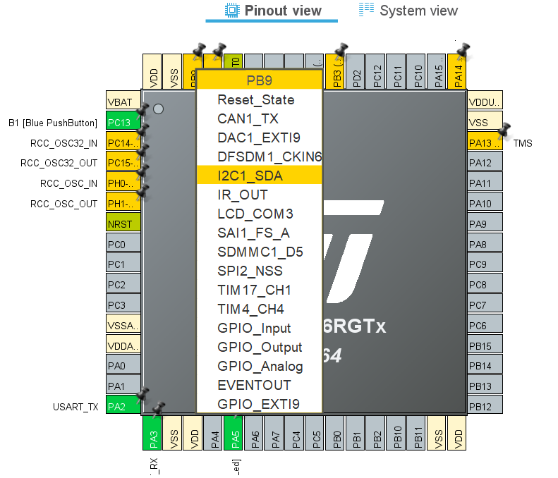
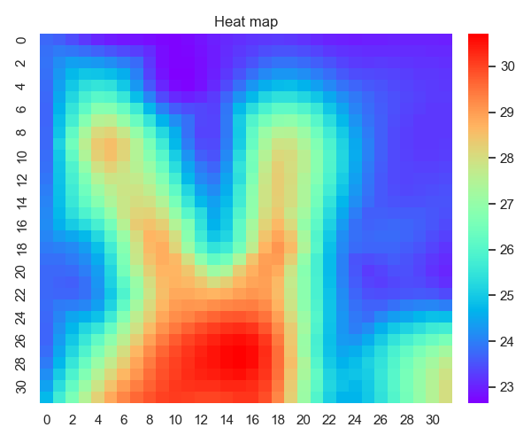
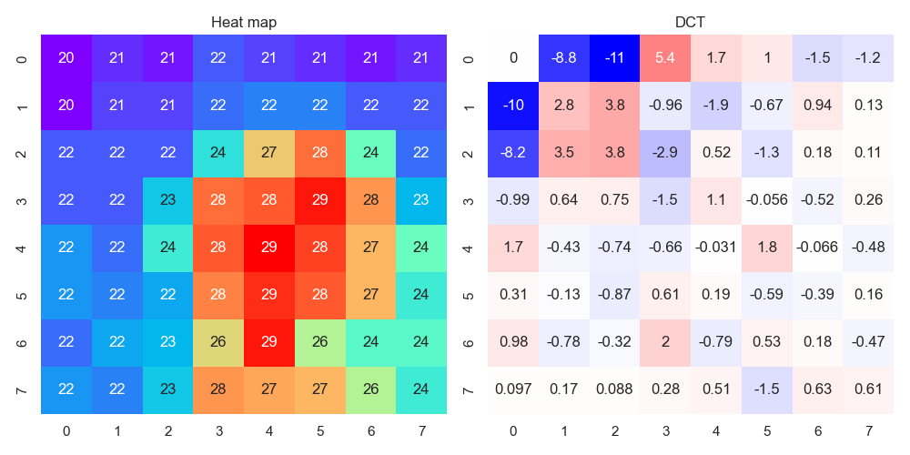
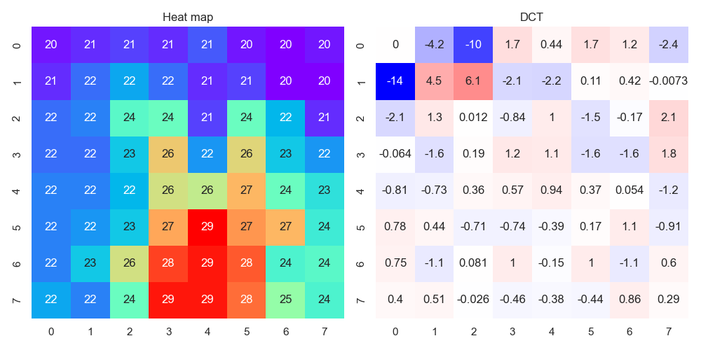

# Thermography

Board: NUCLEO-L476RG board (STM32L476RGT6 Microcontroller)

### Arudino shield for Panasonic AMG8833

I use the infrared array sensor "AMG8833" for hand gesture recognition.


I designed my original Arduino shield for AMG8833 in 2019. Refer to [this page](https://github.com/araobp/stm32-mcu/tree/master/NUCLEO-F401RE/Thermography).

=> [Revised schematic](kicad/RockPaperScissors/arduino_board.pdf)

#### STM32L4 I2C pin assignment for Arduino shield

Arduino shield uses PB8 and PB9 for I2C SCL and SDA.




### Thermography implementation



=> [Code for NUCLEO-L476RG with the Arduino shield](Thermography)

=> [Thermography GUI(Python3)](../python/ThermographyGUI)

Configuration for data collection
```
[NUCLEO L476RG] --- UART (VCP via ST-Link) --- COM port [Thermography GUI]
```

### Integration test

#### Rock


#### Paper


#### Scissors


