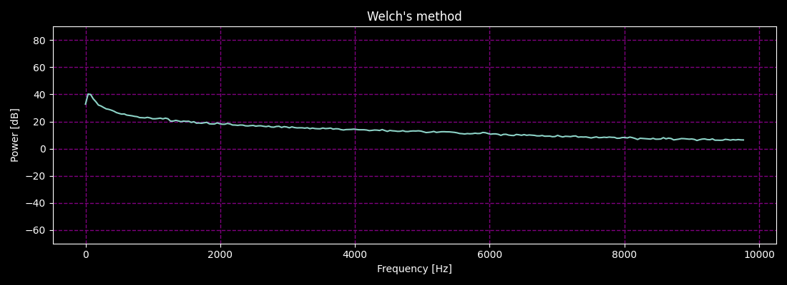

# DFSDM calibration for Knowles MEMS microphones

This page shows if pre-emphasis works or not.

## Condition

FIR(HPF) coefficient for pre-emphasis: 0.95

C code snippet
```
#define NN 512
#define ALPHA 0.95f
float32_t fir_coefficients[2] = { -ALPHA, 1.0f };
arm_fir_instance_f32 S_PRE;
arm_fir_init_f32(&S_PRE, 2, fir_coefficients, state_buf, NN);

void apply_pre_emphasis(float32_t *signal) {
  arm_fir_f32(&S_PRE, signal, signal, NN);
}
```

## Measurement result

#### Welch

Pre-emphasis enabled


Pre-emphasis disabled



#### MFSCs of Japanese vowels (a, i, u, e, o)

Pre-emphasis enabled


Pre-emphasis disabled


